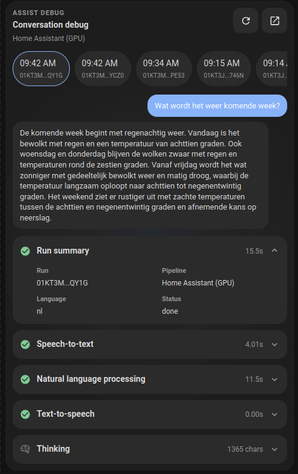

# HA Cards (Lovelace)
[](https://my.home-assistant.io/redirect/hacs_repository/?owner=brantje&repository=ha-cards&category=plugin)

A small collection of **custom Lovelace cards** built with **Lit** and bundled into a single module: `ha-cards.js`.

## Installation

### HACS (recommended)

1. Open custom repositories in HACS
2. Enter the following
   Repository: brantje/ha-cards
   Type: Dashboard
3. Click Add
4. Search for "HA Cards"
5. Download


### Manual

1. Download `dist/ha-cards.js` from the [latest GitHub release](https://github.com/brantje/ha-cards/releases/latest) and copy it to your Home Assistant `config/www/` folder (so it becomes `/local/ha-cards.js`).
2. Add the resource:

```yaml
url: /local/ha-cards.js
type: module
```

## Cards

---

### `possible-issues-card`

   
Lists **devices** that have **entities in “issue” states** (defaults to `unavailable`) and **entities** that match custom value checks. Useful for quickly spotting flaky devices/integrations and known problem states.

Clicking a device row navigates to the device page in Home Assistant. Clicking an entity value-check row opens more info for that entity.

**Config**

- **`type`**: `custom:possible-issues-card`
- **`title`** (optional, default `Possible Issues`): Card title
- **`background_color`** (optional, default `#44739e`): Card background color
- **`domains`** (optional, default `["sensor","light","switch"]`): Domains to consider (array or comma-separated string)
- **`issue_states`** (optional, default `["unavailable"]`): Entity states considered problematic (array or comma-separated string)
- **`value_checks`** (optional): List of entity state checks. Each item supports:
  - **`entity`**: Entity ID to check
  - **`operator`**: `equals` | `not_equals` | `gt` | `lt` | `lte` | `gte` | `contains` | `not_contains`
  - **`values`**: One or more values (array or comma-separated string). Operators match if any value matches, except `not_contains`, which matches only when none of the values are contained.
  - **`message`** (optional): Main row text to show instead of the entity friendly name. Supports templates like `{{ state }}`, `{{ name }}`, `{{ entity_id }}`, `{{ matched_value }}`, `{{ unit }}`, and `{{ attributes.friendly_name }}`.
  - **`submessage`** (optional): Secondary row text to show instead of the generated state/operator detail. Supports the same templates as `message`.
  - **`navigation_path`** (optional): Dashboard/path to navigate to when clicking the matching row. Defaults to opening more-info for the entity.
- **`included_entities`** (optional): Entity IDs or substrings to exclusively include (array or comma-separated string)
- **`ignored_entities`** (optional): Entity IDs or substrings to ignore (array or comma-separated string)
- **`ignored_devices`** (optional): Device IDs or substrings to ignore (array or comma-separated string)
- **`ignored_integrations`** (optional): Integration/platform identifiers to ignore (array or comma-separated string)
- **`ignored_name_patterns`** (optional): Substrings matched against device/entity names to ignore
- **`row_detail`** (optional, default `none`): `none` | `count` | `entities`
  - `none`: show only device name
  - `count`: show affected entity count
  - `entities`: show affected entity names

**Example**

```yaml
type: custom:possible-issues-card
title: Possible Issues
background_color: "#44739e"
domains: sensor, light, switch
issue_states: unavailable, unknown
included_entities: sensor.door, switch.garage
value_checks:
  - entity: sensor.washing_machine_status
    operator: contains
    values:
      - error
      - jammed
    message: Washing machine issue
    submessage: "{{ name }} is {{ state }}"
    navigation_path: /lovelace/issues
  - entity: sensor.freezer_temperature
    operator: gt
    values: "-12"
ignored_integrations: openweathermap, hue
ignored_name_patterns: Test device, Printer
row_detail: count
```

### `welcome-card`


Greeting card with a **date/weather pill**, optional **temperature**, a **settings** button, and configurable **quick tabs**.

**Config**

- **`type`**: `custom:welcome-card`
- **`weather_entity`** (optional): Weather entity (domain `weather.*`) used for icon/emoji and (by default) temperature.
- **`show_temperature`** (optional, default `true`): Show temperature on the date pill.
- **`use_ha_weather_icons`** (optional, default `false`): Use HA MDI weather icons instead of emoji.
- **`temperature_entity`** (optional): Override temperature sensor (domain `sensor.*`) used when `show_temperature` is enabled.
- **`settings_navigation_path`** (optional, default `/config/dashboard`): Navigation path for the settings button.
- **`tabs`** (optional): Array of tabs with:
  - **`icon`**: MDI icon
  - **`label`**: Tab label
  - **`color`** (optional): Accent color
  - **`tap_action`** (optional): Home Assistant action config (e.g. `navigate`, `more-info`, `call-service`, etc.)

**Example**


```yaml
type: custom:welcome-card
weather_entity: weather.home
show_temperature: true
use_ha_weather_icons: false
settings_navigation_path: /config/dashboard
tabs:
  - icon: mdi:home
    label: Home
    color: "#86a9f8"
    tap_action:
      action: navigate
      navigation_path: /lovelace/home
  - icon: mdi:lightbulb
    label: Lights
    color: "#ffd34c"
    tap_action:
      action: navigate
      navigation_path: /lovelace/lights
```

---

### `room-card`


Room tile for a **light** with a prominent **light action button** and up to **two sensor readouts**.

**Config**

- **`type`**: `custom:room-card`
- **`entity`**: Required light entity (`light.*`)
- **`name`** (optional): Display name (falls back to the light friendly name)
- **`icon`** (optional, default `mdi:sofa`): Room icon
- **`sensor1_entity`** / **`sensor2_entity`** (optional): Sensor entities (`sensor.*`)
- **`sensor1_icon`** / **`sensor2_icon`** (optional): Sensor icons (defaults: `mdi:thermometer`, `mdi:water-percent`)
- **`tap_action`** (optional, default `more-info`): Card tap action
- **`light_tap_action`** (optional, default `toggle`): Short press on the light button
- **`light_hold_action`** (optional, default `more-info`): Long press on the light button (500ms)

**Example**

```yaml
type: custom:room-card
entity: light.living_room
name: Living room
icon: mdi:sofa
sensor1_entity: sensor.living_room_temperature
sensor1_icon: mdi:thermometer
sensor2_entity: sensor.living_room_humidity
sensor2_icon: mdi:water-percent
tap_action:
  action: more-info
light_tap_action:
  action: toggle
light_hold_action:
  action: more-info
```

---

### `thermostat-card`


Thermostat card for a **climate** entity with current temperature, setpoint controls, optional HVAC mode buttons, optional preset buttons, fan mode cycling, heating/cooling color states, and icon-tap collapse.

**Config**

- **`type`**: `custom:thermostat-card`
- **`entity`**: Required climate entity (`climate.*`)
- **`name`** (optional): Display name (falls back to the climate friendly name)
- **`icon`** (optional, default `mdi:thermostat`): Header icon
- **`compact`** (optional, default `false`): Always show header only
- **`collapsed_by_default`** (optional, default `false`): Start collapsed; tap the icon to expand/collapse
- **`show_controls`** (optional, default `true`): Show temperature `-` / `+` controls
- **`step_amount`** (optional): Override the entity `target_temp_step`
- **`show_modes`** (optional, default `false`): Show configured HVAC mode buttons
- **`modes`** (optional): HVAC modes to show, e.g. `heat`, `cool`, `heat_cool`
- **`show_off_mode`** (optional, default `false`): Include an `off` mode button when supported
- **`show_presets`** (optional, default `false`): Show configured preset mode buttons
- **`presets`** (optional): Preset modes to show, e.g. `eco`, `comfort`, `away`
- **`show_fan_mode`** (optional, default `false`): Show a fan mode button when the entity supports fan modes
- **`dual_setpoint_layout`** (optional, default `two_rows`): `two_rows` | `single_row_toggle` | `side_by_side`
- **`heating_color`** (optional, default `#fbb73c`): Background color while heating is active
- **`cooling_color`** (optional, default `#3a8dde`): Background color while cooling is active

**Example**

```yaml
type: custom:thermostat-card
entity: climate.living_room
name: Living room
icon: mdi:thermostat
collapsed_by_default: false
show_controls: true
step_amount: 0.5
show_modes: true
modes:
  - heat
  - cool
  - heat_cool
show_off_mode: true
show_presets: true
presets:
  - eco
  - comfort
show_fan_mode: true
dual_setpoint_layout: two_rows
heating_color: "#fbb73c"
cooling_color: "#3a8dde"
```

---

### `assist-chat-card`

Dashboard chat card for **Home Assistant Assist**. It runs the Assist pipeline directly, defaults to text chat, can optionally enable voice input, fetches recent Assist debug runs as chat history, and shows process/timing chips inside the active assistant response. Tool visibility is limited to tool names by default.

**Config**

- **`type`**: `custom:assist-chat-card`
- **`title`** (optional, default `Assist`): Card title / storage label
- **`pipeline_id`** (optional, default `preferred`): Assist pipeline id, `preferred`, or `last_used`
- **`run_count`** (optional, default `5`, max `20`): How many recent Assist debug runs to show as chat history; set to `0` to start empty
- **`show_header`** (optional, default `true`): Show the title, pipeline name and status pill
- **`text_input`** (optional, default `true`): Enable text input
- **`voice_input`** (optional, default `false`): Enable microphone input
- **`continue_conversation`** (optional, default `false`): Continue listening when Assist asks a follow-up
- **`always_continue_conversation`** (optional, default `false`): Always continue listening after voice replies
- **`session_conversation`** (optional, default `true`): Keep the conversation id local to this card (like the built-in Assist dialog) instead of reusing the one from history
- **`disable_speech`** (optional, default `false`): Disable speech controls even when voice input is enabled
- **`enable_audio_playback`** (optional, default `false`): Run the TTS pipeline stage and play reply audio for text and voice input
- **`speech_rms_threshold`** (optional, default `0.01`): Minimum audio level (0–1) before microphone audio is sent to speech-to-text
- **`show_process`** (optional, default `true`): Show STT/intent/TTS timing chips and tool names
- **`show_thinking_until_response`** (optional, default `false`): Keep the thinking section expanded until the response arrives
- **`show_message_time`** (optional, default `false`): Show a timestamp on each message
- **`suggested_prompts`** (optional): Newline-separated prompt chips; supports Home Assistant templating
- **`show_suggested_prompts`** (optional, default `true`): Show prompt chips when the chat is empty
- **`always_show_suggested_prompts`** (optional, default `false`): Keep showing prompt chips once the conversation has messages
- **`background_color`** / **`surface_color`** (optional): Card and input/process surface colors
- **`user_chat_color`** / **`user_chat_text_color`** (optional): User bubble colors
- **`assistant_chat_color`** / **`assistant_chat_text_color`** (optional): Assistant bubble colors

Colors default to the active theme (`--card-background-color`, `--primary-color`, …); setting any color option overrides the theme for that element.

Chat history uses the admin-only `assist_pipeline/pipeline_debug` API. For non-admin users the card automatically disables history (live chat still works); history polling also pauses while the tab is hidden and backs off on errors.

In sections views, card height follows dashboard layout via `grid_options.rows` (for example `rows: 12`). Messages scroll inside the allocated area while the input row stays at the bottom.

**Example**

```yaml
type: custom:assist-chat-card
title: Assist
pipeline_id: preferred
run_count: 5
text_input: true
voice_input: false
show_process: true
show_thinking_until_response: false
grid_options:
  columns: 12
  rows: 12
```

---

### `assist-debug-card`



Shows Home Assistant **Assist pipeline debug runs** (STT → intent → TTS), including raw events and (optionally) live “thinking” updates while a run is in progress.

**Config**

- **`type`**: `custom:assist-debug-card` or `custom:conversation-debug-card`
- **`title`** (optional, default `Assist debug`): Card title
- **`pipeline_id`** (optional, default `preferred`): Assist pipeline id to show runs for
- **`run_count`** (optional, default `5`): How many recent runs to list
- **`minimalistic_mode`** (optional, default `false`): Compact header / less chrome
- **`visualization_only`** (optional, default `false`): Only show the audio visualization
- **`conversation_only`** (optional, default `false`): Only show the conversation view
- **`show_conversation`** (optional, default `false`): Show conversation bubbles in the full view
- **`metadata_mode`** (optional, default `compact`): `hidden` | `compact` | `full`
- **`show_raw`** (optional, default `true`): Show collapsible raw JSON events
- **`show_thinking`** (optional, default `true`): Show “thinking” (and live-refresh while a run is active)
- **`show_summary`** (optional, default `true`): Show run summary section
- **`show_stt`** (optional, default `true`): Show speech-to-text stage
- **`show_intent`** (optional, default `true`): Show intent/NLP stage
- **`show_tts`** (optional, default `true`): Show text-to-speech stage
- **`mask_transcripts`** (optional, default `false`): Mask raw text/transcripts in the UI
- **`audio_visualization`** (optional, default `false`): Enable audio visualization
- **`audio_visualization_type`** (optional, default `waveform`): `waveform` | `spectrum` | `meter` | `glow` | `ulysse31`
- **`audio_visualization_position`** (optional, default `below_chat`): `background` | `top` | `between` | `below_chat`
- **`audio_visualization_height`** (optional, default `56`): Visualization height in pixels
- **`audio_visualization_color`** (optional): Primary visualization color
- **`audio_visualization_secondary_color`** (optional): Secondary visualization color
- **`audio_visualization_background`** (optional): Visualization background color
- **`audio_visualization_opacity`** (optional, default `0.75`): Visualization opacity
- **`audio_visualization_start_delay`** (optional, default `0`): Delay before starting visualization (ms)

**Example**

```yaml
type: custom:assist-debug-card
title: Assist debug
pipeline_id: preferred
run_count: 10
show_conversation: true
show_raw: true
show_thinking: true
audio_visualization: true
audio_visualization_type: waveform
audio_visualization_position: below_chat
```


## Development

```bash
npm install
npm run dev
```

Build locally:

```bash
npm run build
```

Output: `dist/ha-cards.js` (not committed; CI builds it for releases).

Run tests:

```bash
npm test
```

## Releasing

1. Merge changes to `main`.
2. Create and push a version tag:

```bash
git checkout main && git pull
git tag v1.2.3
git push origin v1.2.3
```

3. GitHub Actions runs tests, builds `dist/ha-cards.js`, and publishes a GitHub Release with that file attached.
4. HACS users receive the new version from the release tag.

