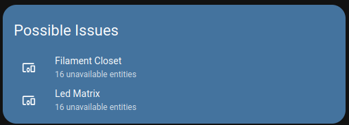
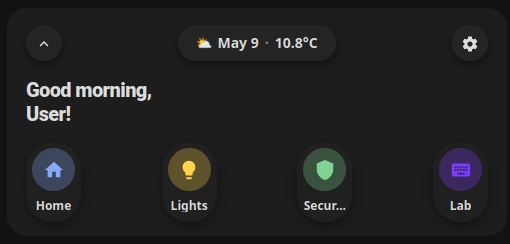
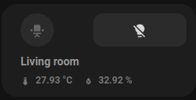
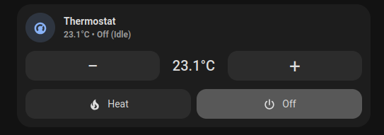

# HA Cards (Lovelace)
[](https://my.home-assistant.io/redirect/hacs_repository/?owner=brantje&repository=ha-cards&category=plugin)

A small collection of **custom Lovelace cards** built with **Lit** and bundled into a single module: `ha-cards.js`.

## Installation

### HACS (recommended)

1. Open custom repositories in HACS
2. Enter the following
   Repository: brantje/ha-cards
   Type: Dashboard
3. Click Add
4. Search for "HA Cards"
5. Download


### Manual

1. Download/copy `dist/ha-cards.js` to your Home Assistant `config/www/` folder (so it becomes `/local/ha-cards.js`).
2. Add the resource:

```yaml
url: /local/ha-cards.js
type: module
```

## Cards

---

### `possible-issues-card`

   
Lists **devices** that have **entities in “issue” states** (defaults to `unavailable`) and **entities** that match custom value checks. Useful for quickly spotting flaky devices/integrations and known problem states.

Clicking a device row navigates to the device page in Home Assistant. Clicking an entity value-check row opens more info for that entity.

**Config**

- **`type`**: `custom:possible-issues-card`
- **`title`** (optional, default `Possible Issues`): Card title
- **`background_color`** (optional, default `#44739e`): Card background color
- **`domains`** (optional, default `["sensor","light","switch"]`): Domains to consider (array or comma-separated string)
- **`issue_states`** (optional, default `["unavailable"]`): Entity states considered problematic (array or comma-separated string)
- **`value_checks`** (optional): List of entity state checks. Each item supports:
  - **`entity`**: Entity ID to check
  - **`operator`**: `equals` | `not_equals` | `gt` | `lt` | `lte` | `gte` | `contains` | `not_contains`
  - **`values`**: One or more values (array or comma-separated string). Operators match if any value matches, except `not_contains`, which matches only when none of the values are contained.
  - **`message`** (optional): Main row text to show instead of the entity friendly name. Supports templates like `{{ state }}`, `{{ name }}`, `{{ entity_id }}`, `{{ matched_value }}`, `{{ unit }}`, and `{{ attributes.friendly_name }}`.
  - **`submessage`** (optional): Secondary row text to show instead of the generated state/operator detail. Supports the same templates as `message`.
  - **`navigation_path`** (optional): Dashboard/path to navigate to when clicking the matching row. Defaults to opening more-info for the entity.
- **`included_entities`** (optional): Entity IDs or substrings to exclusively include (array or comma-separated string)
- **`ignored_entities`** (optional): Entity IDs or substrings to ignore (array or comma-separated string)
- **`ignored_devices`** (optional): Device IDs or substrings to ignore (array or comma-separated string)
- **`ignored_integrations`** (optional): Integration/platform identifiers to ignore (array or comma-separated string)
- **`ignored_name_patterns`** (optional): Substrings matched against device/entity names to ignore
- **`row_detail`** (optional, default `none`): `none` | `count` | `entities`
  - `none`: show only device name
  - `count`: show affected entity count
  - `entities`: show affected entity names

**Example**

```yaml
type: custom:possible-issues-card
title: Possible Issues
background_color: "#44739e"
domains: sensor, light, switch
issue_states: unavailable, unknown
included_entities: sensor.door, switch.garage
value_checks:
  - entity: sensor.washing_machine_status
    operator: contains
    values:
      - error
      - jammed
    message: Washing machine issue
    submessage: "{{ name }} is {{ state }}"
    navigation_path: /lovelace/issues
  - entity: sensor.freezer_temperature
    operator: gt
    values: "-12"
ignored_integrations: openweathermap, hue
ignored_name_patterns: Test device, Printer
row_detail: count
```

### `welcome-card`



Greeting card with a **date/weather pill**, optional **temperature**, a **settings** button, and configurable **quick tabs**.

**Config**

- **`type`**: `custom:welcome-card`
- **`weather_entity`** (optional): Weather entity (domain `weather.*`) used for icon/emoji and (by default) temperature.
- **`show_temperature`** (optional, default `true`): Show temperature on the date pill.
- **`use_ha_weather_icons`** (optional, default `false`): Use HA MDI weather icons instead of emoji.
- **`temperature_entity`** (optional): Override temperature sensor (domain `sensor.*`) used when `show_temperature` is enabled.
- **`settings_navigation_path`** (optional, default `/config/dashboard`): Navigation path for the settings button.
- **`tabs`** (optional): Array of tabs with:
  - **`icon`**: MDI icon
  - **`label`**: Tab label
  - **`color`** (optional): Accent color
  - **`tap_action`** (optional): Home Assistant action config (e.g. `navigate`, `more-info`, `call-service`, etc.)

**Example**


```yaml
type: custom:welcome-card
weather_entity: weather.home
show_temperature: true
use_ha_weather_icons: false
settings_navigation_path: /config/dashboard
tabs:
  - icon: mdi:home
    label: Home
    color: "#86a9f8"
    tap_action:
      action: navigate
      navigation_path: /lovelace/home
  - icon: mdi:lightbulb
    label: Lights
    color: "#ffd34c"
    tap_action:
      action: navigate
      navigation_path: /lovelace/lights
```

---

### `room-card`


Room tile for a **light** with a prominent **light action button** and up to **two sensor readouts**.

**Config**

- **`type`**: `custom:room-card`
- **`entity`**: Required light entity (`light.*`)
- **`name`** (optional): Display name (falls back to the light friendly name)
- **`icon`** (optional, default `mdi:sofa`): Room icon
- **`sensor1_entity`** / **`sensor2_entity`** (optional): Sensor entities (`sensor.*`)
- **`sensor1_icon`** / **`sensor2_icon`** (optional): Sensor icons (defaults: `mdi:thermometer`, `mdi:water-percent`)
- **`tap_action`** (optional, default `more-info`): Card tap action
- **`light_tap_action`** (optional, default `toggle`): Short press on the light button
- **`light_hold_action`** (optional, default `more-info`): Long press on the light button (500ms)

**Example**

```yaml
type: custom:room-card
entity: light.living_room
name: Living room
icon: mdi:sofa
sensor1_entity: sensor.living_room_temperature
sensor1_icon: mdi:thermometer
sensor2_entity: sensor.living_room_humidity
sensor2_icon: mdi:water-percent
tap_action:
  action: more-info
light_tap_action:
  action: toggle
light_hold_action:
  action: more-info
```

---

### `thermostat-card`


Thermostat card for a **climate** entity with current temperature, setpoint controls, optional HVAC mode buttons, optional preset buttons, fan mode cycling, heating/cooling color states, and icon-tap collapse.

**Config**

- **`type`**: `custom:thermostat-card`
- **`entity`**: Required climate entity (`climate.*`)
- **`name`** (optional): Display name (falls back to the climate friendly name)
- **`icon`** (optional, default `mdi:thermostat`): Header icon
- **`compact`** (optional, default `false`): Always show header only
- **`collapsed_by_default`** (optional, default `false`): Start collapsed; tap the icon to expand/collapse
- **`show_controls`** (optional, default `true`): Show temperature `-` / `+` controls
- **`step_amount`** (optional): Override the entity `target_temp_step`
- **`show_modes`** (optional, default `false`): Show configured HVAC mode buttons
- **`modes`** (optional): HVAC modes to show, e.g. `heat`, `cool`, `heat_cool`
- **`show_off_mode`** (optional, default `false`): Include an `off` mode button when supported
- **`show_presets`** (optional, default `false`): Show configured preset mode buttons
- **`presets`** (optional): Preset modes to show, e.g. `eco`, `comfort`, `away`
- **`show_fan_mode`** (optional, default `false`): Show a fan mode button when the entity supports fan modes
- **`dual_setpoint_layout`** (optional, default `two_rows`): `two_rows` | `single_row_toggle` | `side_by_side`
- **`heating_color`** (optional, default `#fbb73c`): Background color while heating is active
- **`cooling_color`** (optional, default `#3a8dde`): Background color while cooling is active

**Example**

```yaml
type: custom:thermostat-card
entity: climate.living_room
name: Living room
icon: mdi:thermostat
collapsed_by_default: false
show_controls: true
step_amount: 0.5
show_modes: true
modes:
  - heat
  - cool
  - heat_cool
show_off_mode: true
show_presets: true
presets:
  - eco
  - comfort
show_fan_mode: true
dual_setpoint_layout: two_rows
heating_color: "#fbb73c"
cooling_color: "#3a8dde"
```


## Development

```bash
npm install
npm run dev
```

Build output:

- `dist/ha-cards.js`

